# Image & Video Compression Lab — a from-scratch hybrid video codec

A complete, from-scratch implementation of a JPEG/MPEG-style hybrid video
codec — block DCT transform coding, scalar quantization, zigzag scanning,
run-level coding, Huffman entropy coding, block motion estimation and
compensation, and an I-frame/P-frame hybrid coding structure — plus several
extensions beyond the base requirements: half-pel motion estimation,
rate-distortion-optimized coefficient decisions, and an in-loop deblocking
filter in the style of H.264/AVC.

[]()
[](LICENSE)

## Overview

Every lossy image and video codec in wide use — JPEG, MPEG-2, H.264/AVC,
HEVC, AV1 — is built from the same handful of ideas: transform the signal
into a domain where energy is concentrated in a few coefficients, throw away
precision proportional to how little each coefficient matters, code what's
left as efficiently as possible, and, for video, avoid re-sending anything
that can instead be *predicted* from an already-decoded frame. This project
implements that whole pipeline from scratch — not by calling a transform- or
entropy-coding library, but by writing the DCT basis, the quantizer, the
zigzag scan, the Huffman tree construction, the block-matching motion
search, and the motion-compensated prediction loop as plain, readable
NumPy-free Octave/MATLAB code.

It started as the practical lab course *"Image and Video Compression Lab
Course"* (Lehrstuhl für Multimediakommunikation und Signalverarbeitung,
FAU Erlangen-Nürnberg, Summer Term 2022) and was pushed well past the
course's own requirements: a configurable optimized codec
(`encoder_opt`/`decoder_opt`) with every extension switchable per run, a
full benchmark suite that regenerates every number and figure in this README
from the raw test sequences, and — documented in
[`docs/EXERCISES.md`](docs/EXERCISES.md) — a complete audit of the original
course-provided skeleton, which turned out to contain a large number of
non-functional or entirely missing functions. Every one of those is listed
there with exactly what was broken and how it was fixed, validated against
the course's own test harnesses wherever one exists.

**Why this might be useful to you.** Real encoders (x264, libvpx, the HEVC/AV1
reference software) are hundreds of thousands of lines of highly optimized C,
built for speed rather than for being read. This is the opposite trade-off: a
few thousand lines of commented, block-by-block Octave/MATLAB that implement
the same core ideas end to end and can be read, run, and modified in an
afternoon. It's released under the MIT license specifically so it can be used
that way — to learn how a hybrid video codec actually works, to check your
own understanding against a working reference, or as a starting point for
your own experiments with quantization, motion search, or entropy coding.

## Methodology

**Coding structure.** The first frame of a sequence is intra-coded (no
prediction): a block DCT (`blockbased_dct_on_image.m`, built from an explicit
orthonormal DCT-II basis rather than `dct2`/`idct2`, so it has no toolbox
dependency), a quantizer matrix scaled by QP
(`blockbased_quantizer_to_levels.m`), a zigzag scan
(`blockbased_encoding_to_zigzag_scanned.m`), run-level coding
(`blockbased_encoding_to_runlevel_representation.m`), and Huffman entropy
coding built from the actual symbol statistics of the frame being coded.
Every subsequent frame is coded as a P-frame: block motion estimation against
the *decoded* reference frame (never the original, since the decoder doesn't
have that), motion compensation to form a prediction, and the same
transform/quantize/scan/entropy pipeline applied to the residual. The encoder
runs its own decoding loop internally so the reference it uses for the next
frame is bit-identical to what the real decoder will reconstruct.

**Motion estimation strategies.** Three block-matching search strategies are
implemented against the same per-block interface
(`get_motion_vector_for_block*.m`): exhaustive full search, the logarithmic
search, and the 3-step (multi-step) search — the latter two are standard
fast approximations to full search used throughout the video coding
literature. A half-pel (sub-pixel) extension
(`blockbased_motion_search_subpel.m`, `upsample_half_pel.m`) searches on a
bilinearly-interpolated reference frame for finer motion accuracy.

**Extensions beyond the lab requirements:**
- **Rate-distortion-optimized coefficient decisions** (`rdo_zero_blocks.m`) —
  per transform block, the encoder chooses between coding the quantized
  coefficients and transmitting an all-zero block, whichever minimizes the
  Lagrangian cost J = D + λR. Because the DCT basis used here is orthonormal,
  Parseval's theorem makes the distortion term exact and free to compute (no
  trial reconstruction needed): the squared error from zeroing a block in the
  DCT domain equals the squared error it would cause in the pixel domain.
- **In-loop deblocking filter** (`deblock_frame.m`) — a conditional weak
  filter at transform-block edges, applied identically inside the encoder's
  reconstruction loop and the decoder (so both stay in sync), following the
  structure of H.264/AVC's deblocking stage (ITU-T H.264 §8.7): an edge is
  only smoothed where the step across it is small enough to plausibly be a
  coding artifact rather than real image content, with threshold and filter
  strength tied to the quantizer step size for that QP.
- **SSIM** alongside PSNR as a perceptual quality metric throughout.

**Validation methodology.** Every function is validated at one of four
levels, recorded per-exercise in [`docs/EXERCISES.md`](docs/EXERCISES.md):
*Harness* (passes the course's own `verify_*.m` test), *Pipeline* (exercised
end-to-end by real encoder/decoder round trips on real test sequences, at
measured PSNR/SSIM), *Equivalence* (asserted bit-identical to an
already-validated reference implementation — used for the vectorized
"fast" Huffman and zigzag code paths), or *Review* (checked by hand against
the course manual's specification).

**Benchmark methodology.** `benchmark_codec.m` measures the *true* number of
entropy-coded bits the encoder actually produces — not the size of a saved
`.mat` container, which the course-provided reference harness uses and which
mostly measures MATLAB's file format. Rate-distortion comparisons are
additionally summarized as a single [Bjøntegaard-delta (BD-rate)](code/bd_rate.m)
number: the average bitrate saved by one curve over another at equal quality,
the standard way the video-coding literature reports this kind of result.
Every number and figure in this README is produced by one script,
[`run_all_benchmarks.m`](code/run_all_benchmarks.m), run directly against the
raw `.yuv` test sequences — nothing here is hand-curated.

## Key Results

All figures are generated directly by `run_all_benchmarks.m` from the raw
test sequences — see [Getting Started](#getting-started) to reproduce them.

### Hybrid coding vs. intra-only

<p align="center">
  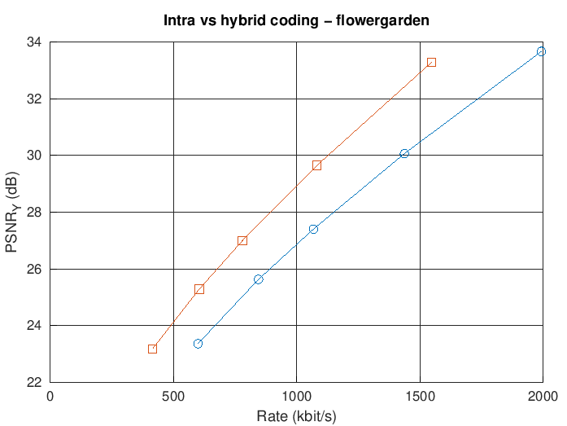
  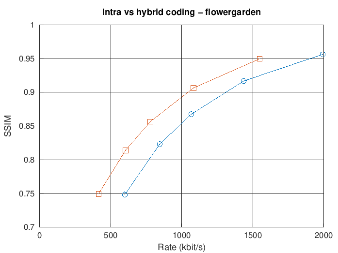
</p>

Coding every frame independently (intra-only, the JPEG-style baseline) versus
coding frames 2–5 as motion-compensated P-frames against the previous
*reconstructed* frame (hybrid, full-search motion estimation): on the
flowergarden sequence, hybrid coding reaches the same quality as intra-only
coding at a **22.78% lower bitrate** (BD-rate), the expected result of
exploiting temporal redundancy between frames and the whole reason P-frames
exist in every video codec in use today.

### Motion estimation strategy: quality vs. speed

<p align="center">
  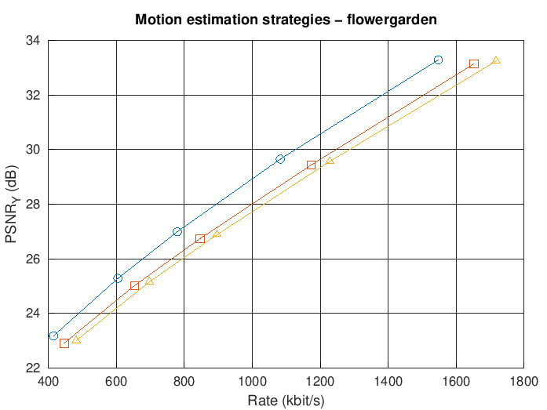
  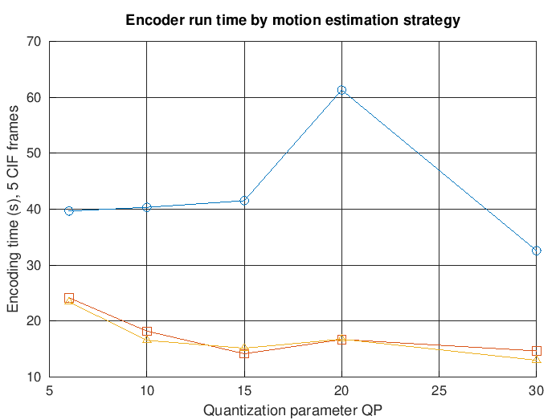
</p>

Exhaustive full search gives the best rate-distortion performance, as
expected, but at a real cost: on this sequence it takes **2.4–2.5× longer**
to encode than the 3-step or logarithmic fast search heuristics. Those faster
searches give that speedup back at a BD-rate cost of **11.41%** (3-step) and
**15.56%** (logarithmic) more bits for the same quality — a concrete,
measured version of the complexity/compression trade-off every real-time
video encoder has to make.

### Extension ablation

<p align="center">
  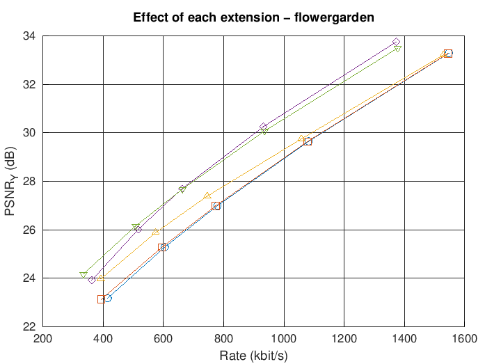
  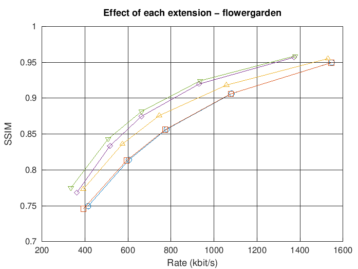
</p>

Each extension added in isolation on top of the baseline hybrid codec
(full-search ME, no RDO, no deblocking), measured by BD-rate against that
baseline:

| Extension | BD-rate vs. baseline |
|---|---|
| + RD-optimized coefficient decisions | −0.95% |
| + In-loop deblocking filter | −7.40% |
| + Half-pel motion estimation | −21.00% |
| **All three combined** | **−21.26%** |

Half-pel motion estimation accounts for almost all of the combined gain —
unsurprising, since flowergarden's camera pan rarely aligns with
whole-pixel motion, so sub-pixel accuracy removes a systematic prediction
error that no amount of better entropy coding downstream can fix. The
combined gain (−21.26%) is close to, not the sum of, the three individual
gains: deblocking's benefit substantially overlaps with what half-pel
prediction already cleans up, which is the expected, textbook interaction
between these two extensions.

### Generalization across test sequences

<p align="center">
  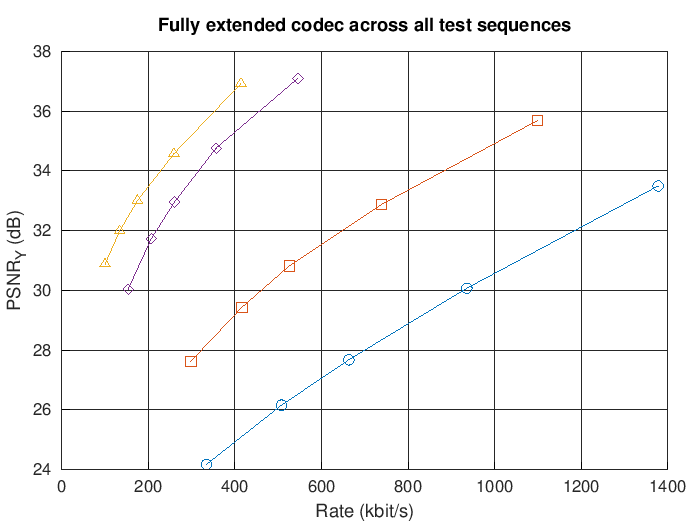
  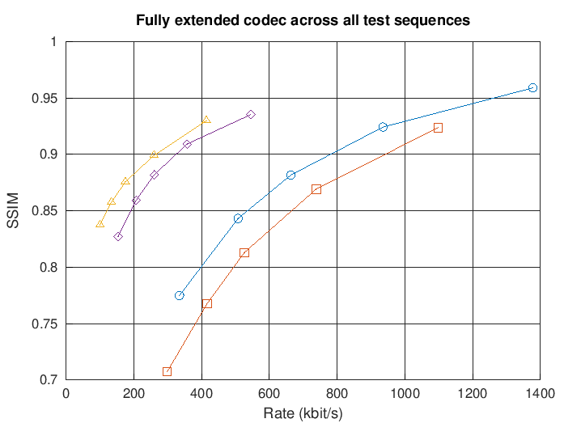
</p>

The fully extended codec evaluated on all four available CIF test sequences,
to check the results above aren't an artifact of one specific sequence.
Required bitrate at matched quality varies by roughly 5× across content:
shuttle and vimto (static camera, low detail) need as little as ~100–150
kbit/s for >30 dB PSNR, while rugby and flowergarden (camera motion, high
spatial detail/texture) need several times that — exactly the
content-dependent behavior a rate-distortion-optimized hybrid codec should
show.

### Comparison against a JPEG baseline

<p align="center">
  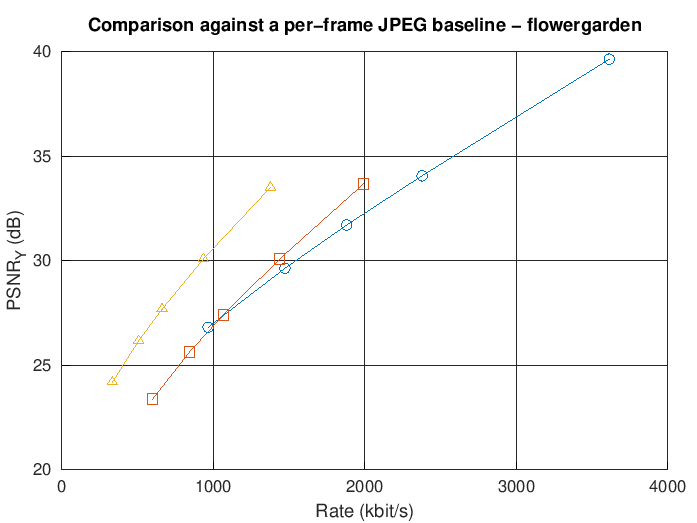
</p>

Against per-frame JPEG encoding (MATLAB/Octave's own
`imwrite(...,'jpeg',...)`) on the same frames of flowergarden:

| Configuration | BD-rate vs. JPEG |
|---|---|
| This codec, intra-only (apples-to-apples — no temporal prediction either side) | **−7.24%** |
| This codec, fully extended (with motion-compensated P-frames) | **−39.91%** |

The intra-only comparison is the fair one — neither side uses information
from other frames — and this codec's custom-designed quantizer matrix and
per-frame-adaptive Huffman table already beat JPEG's standard tables by
7.24% BD-rate on this content. The larger gap once P-frames are enabled is
expected rather than a surprise: JPEG has no mechanism for exploiting
temporal redundancy at all, which is precisely the gap hybrid video codecs
exist to close.

### Visual results

<p align="center">
  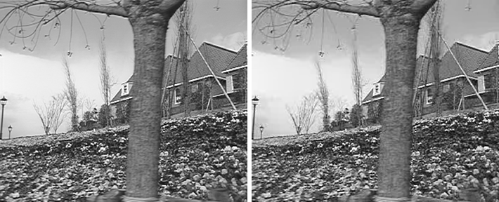
</p>

*Original (left) vs. reconstructed (right) frame 3 of flowergarden, fine
quantization (QP 10, fully extended codec): 30.11 dB, visually
indistinguishable from the source.*

<p align="center">
  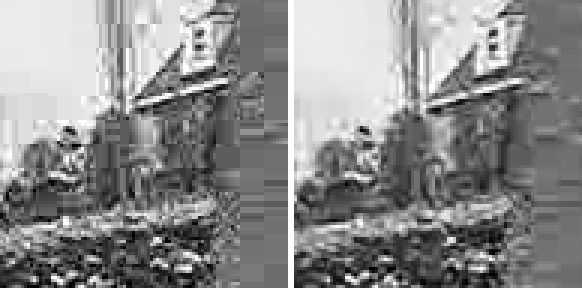
</p>

*Zoomed crop at a coarse quantizer (QP 30): without the in-loop deblocking
filter (left, 23.29 dB) vs. with it enabled (right, 24.10 dB) — the
filter visibly smooths the 8×8 transform-block grid artifacts along the
roofline and sky without blurring real edges.*

<p align="center">
  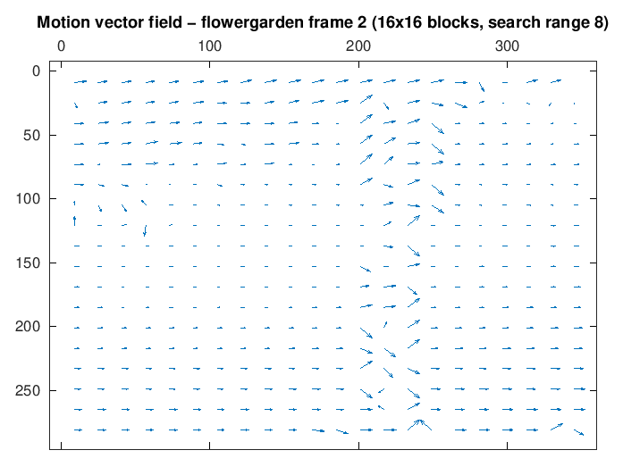
</p>

*Block motion vectors (16×16 blocks, search range 8) between frames 1 and 2
of flowergarden: the mostly-uniform leftward vectors are the panning
camera; the tree trunk in the right-of-center foreground moves against
that background at a different apparent rate, and the occlusion it creates
produces the locally inconsistent vectors around it — exactly the
failure mode of block matching that more advanced motion models exist to
address.*

## Repository Structure

```
image-video-compression-lab/
├── README.md
├── LICENSE                                MIT (author's own code — see License section)
├── .gitignore
├── code/
│   ├── Entropy coding
│   │   ├── create_huffman_table_from_signal.m / _from_probability.m
│   │   ├── encode_signal_to_huffman_bitstream.m / decode_signal_from_huffman_bitstream.m
│   │   └── *_fast.m                        vectorized variants (bit-identical, see Equivalence tests)
│   ├── Quantization & distortion metrics
│   │   ├── scalar_quantizer.m / scalar_dequantizer.m
│   │   ├── blockbased_quantizer_to_levels.m / blockbased_dequantizer_from_levels.m
│   │   ├── design_quantizer_matrix.m, get_quantisation_matrix.m
│   │   └── mse_of_frame.m, psnr_of_frame.m, ssim_of_frame.m
│   ├── Transform & scan
│   │   ├── dct_matrix.m, blockbased_dct_on_image.m / blockbased_idct_on_image.m
│   │   ├── generate_zigzag_permutation_matrix.m
│   │   └── blockbased_encoding/decoding_to_zigzag_scanned*.m
│   ├── Run-level coding
│   │   └── *_runlevel_representation.m (block-based and vectorized variants)
│   ├── Motion estimation & compensation
│   │   ├── calculate_sad.m, get_motion_vector_for_block*.m (full / 3-step / log / subpel)
│   │   ├── blockbased_motion_search*.m, blockbased_motion_compensation*.m
│   │   └── upsample_half_pel.m
│   ├── Extensions
│   │   ├── rdo_zero_blocks.m                rate-distortion optimized coefficient decisions
│   │   └── deblock_frame.m                  in-loop deblocking filter
│   ├── Encoders / decoders
│   │   ├── encoder_basic.m / decoder_basic.m            required hybrid codec
│   │   ├── encoder_basic_intra.m / decoder_basic_intra.m  intra-only codec
│   │   ├── encoder_opt.m / decoder_opt.m                configurable codec (all extensions switchable)
│   │   └── final_encoder.m / final_decoder.m            fixed-parameter wrapper (Exercise 6.15)
│   ├── Benchmarking
│   │   ├── benchmark_codec.m, benchmark_jpeg_baseline.m
│   │   ├── bd_rate.m                        Bjøntegaard-delta rate calculation
│   │   └── run_all_benchmarks.m             regenerates every number/figure in this README
│   ├── verify_*.m                           course-provided + authored correctness tests
│   └── third_party/                         third-party reference code — see NOTICE.md
├── results/
│   ├── figures/                             all PNG/EPS plots referenced above
│   └── data/                                saved benchmark outputs (.mat)
├── report/
│   └── Prakt_IVC_2022.pdf                   the course's lab manual (specification this code implements)
└── docs/
    └── EXERCISES.md                         exercise-by-exercise file map, bug-fix log, and validation record
```

## Getting Started

Requires **GNU Octave 11.3+** (developed and benchmarked on Octave; MATLAB
with the Image Processing Toolbox also works) with the `image` package:

```
pkg install -forge image    % Octave only; MATLAB users need the Image Processing Toolbox instead
```

Every entry point calls `setup_codec()` first, which loads that package under
Octave and is a no-op under MATLAB.

**Encode and decode one sequence** with the fixed-parameter wrapper:

```matlab
setup_codec();
addpath(genpath('code'));   % or simply cd into code/
final_encoder('flowergarden_short_cif.yuv', 'coded.mat', 352, 288, 5, 15);
final_decoder('coded.mat', 'reconstructed.yuv');
```

**Run the configurable codec** with specific extensions enabled:

```matlab
options = struct('me_strategy', 'subpel', 'rdo', true, 'deblock', true);
encoder_opt('flowergarden_short_cif.yuv', 'coded.mat', 352, 288, 5, 8, 15, 16, 8, options);
decoder_opt('coded.mat', 'reconstructed.yuv');
```

**Reproduce every number and figure in this README:**

```matlab
cd code
run_all_benchmarks('all', '..');     % or a single stage: 'verify'|'dr'|'me'|'ablation'|'sequences'|'jpeg'|'visuals'
```

This runs the real encoder/decoder dozens of times across several
quantization parameters, sequences, and configurations — expect it to take
on the order of an hour on a typical laptop, since motion estimation in
interpreted Octave is not fast. Each stage can be run independently (and
re-run on its own) via the `stage` argument.

## Validation

[`docs/EXERCISES.md`](docs/EXERCISES.md) maps every exercise in the course
manual to the file(s) that implement it, its validation level, and — for
everything that needed fixing — exactly what was broken in the
course-provided skeleton and how it was corrected. This is the authoritative
record of what was already working, what was fixed, and what was written
from scratch.

## Citation

If you use this code, please cite it as:

```bibtex
@software{dhariwal2022ivc,
  author = {Dhariwal, Aakarsh},
  title  = {Image \& Video Compression Lab: A From-Scratch Hybrid Video Codec},
  year   = {2022},
  url    = {https://github.com/aakarshdhariwal/image-video-compression-lab}
}
```

Machine-readable citation metadata is also available in
[`CITATION.cff`](CITATION.cff).

## Author

**Aakarsh Dhariwal** — Friedrich-Alexander-Universität Erlangen-Nürnberg (FAU)

*Image and Video Compression Lab Course*, Lehrstuhl für Multimediakommunikation
und Signalverarbeitung (LMS), Summer Term 2022.

## License

The author's own code under `code/` (excluding `code/third_party/`) is
released under the [MIT License](LICENSE) — including the test sequences'
derived results, the benchmark suite, and every extension beyond the course
requirements — specifically so it can be freely reused for learning,
teaching, or further experimentation.

- `code/third_party/` keeps its original authorship; see
  [`code/third_party/NOTICE.md`](code/third_party/NOTICE.md).
- `report/Prakt_IVC_2022.pdf` is course material of the Chair of Multimedia
  Communications and Signal Processing (LMS), FAU Erlangen-Nürnberg,
  included as the specification this code implements and is not covered by
  this license.
- The test sequences, verification fixtures, and course-provided
  infrastructure functions listed in [`LICENSE`](LICENSE) were supplied with
  the lab course and are likewise not covered by this license.
